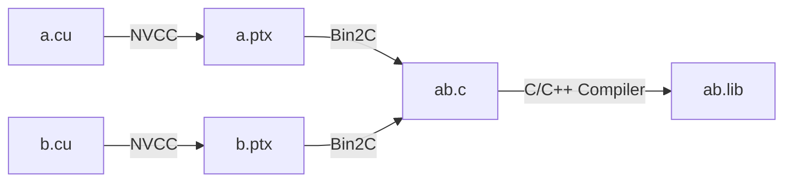

# Learn Optix

## 编译 .cu

[NVIDIA BLOG: Building Cross-Platform CUDA Applications with CMake](https://developer.nvidia.com/blog/building-cuda-applications-cmake/)

[NVIDIA FORUMS: Simple PTX shader - OptiX 7](https://forums.developer.nvidia.com/t/simple-ptx-shader-optix-7/165303/6?u=jingyu.xiong)

[GITHUB: Parallel Forall Code Samples](https://github.com/robertmaynard/code-samples/blob/master/posts/cmake_ptx/CMakeLists.txt)

### 编译单个 .cu 文件

编译单个的 .cu 文件可以分为三个步骤：

1. 使用 NVCC 将 .cu 文件编译为 .ptx 文件；

2. 使用 Bin2C 将 .ptx 文件转为 .c 文件中包含一个字符串数组；

3. 使用 C/C++ 编译器将 .c 文件编译为 .lib。

其中 Bin2C 是 CUDA 自带的工具，可以将 .ptx 文件转化为`常量字符串`存储在 .c 文件里。

### 编译多个 .cu 文件

