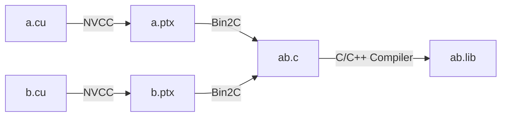

# Learn Optix

## 编译
### 编译 .cu

[NVIDIA BLOG: Building Cross-Platform CUDA Applications with CMake](https://developer.nvidia.com/blog/building-cuda-applications-cmake/)

[NVIDIA FORUMS: Simple PTX shader - OptiX 7](https://forums.developer.nvidia.com/t/simple-ptx-shader-optix-7/165303/6?u=jingyu.xiong)

[GITHUB: Parallel Forall Code Samples](https://github.com/robertmaynard/code-samples/blob/master/posts/cmake_ptx/CMakeLists.txt)

#### 编译单个 .cu 文件

编译单个的 .cu 文件可以分为三个步骤：

1. 使用 NVCC 将 .cu 文件编译为 .ptx 文件；

2. 使用 Bin2C 将 .ptx 文件转为 .c 文件中包含一个字符串数组；

3. 使用 C/C++ 编译器将 .c 文件编译为 .lib。

其中 Bin2C 是 CUDA 自带的工具，可以将 .ptx 文件转化为`常量字符串`存储在 .c 文件里。

#### 编译多个 .cu 文件

### 编译设置

#### CMake Generator Expressions
[Conditional Expressions](https://cmake.org/cmake/help/latest/manual/cmake-generator-expressions.7.html#conditional-expressions)

[Logical Operators](https://cmake.org/cmake/help/latest/manual/cmake-generator-expressions.7.html#logical-operators)

[$<COMPILE_LANGUAGE:CUDA>](https://cmake.org/cmake/help/latest/manual/cmake-generator-expressions.7.html#genex:COMPILE_LANGUAGE)

[$<TARGET_PROPERTY:prop>](https://cmake.org/cmake/help/latest/manual/cmake-generator-expressions.7.html#genex:TARGET_PROPERTY)

#### NVCC Command Options

[--gpu-architecture {} (-arch)](https://docs.nvidia.com/cuda/cuda-compiler-driver-nvcc/index.html#options-for-steering-gpu-code-generation-gpu-architecture)

[--display-error-number (-err-no)](https://docs.nvidia.com/cuda/cuda-compiler-driver-nvcc/index.html#generic-tool-options-err-no)

[--diag-suppress {errNum,...} (-diag-suppress)](https://docs.nvidia.com/cuda/cuda-compiler-driver-nvcc/index.html#generic-tool-options-diag-suppress)

[--std {} (-std)](https://docs.nvidia.com/cuda/cuda-compiler-driver-nvcc/index.html#options-for-altering-compiler-linker-behavior-std)

[--use_fast_math (-use_fast_math)](https://docs.nvidia.com/cuda/cuda-compiler-driver-nvcc/index.html#options-for-steering-gpu-code-generation-use_fast_math)

[--expt-relaxed-constexpr (-expt-relaxed-constexpr)](https://docs.nvidia.com/cuda/cuda-compiler-driver-nvcc/index.html#options-for-altering-compiler-linker-behavior-expt-relaxed-constexpr)

[--extended-lambda (-extended-lambda)](https://docs.nvidia.com/cuda/cuda-compiler-driver-nvcc/index.html#options-for-altering-compiler-linker-behavior-extended-lambda)

[--forward-unknown-to-host-compiler (-forward-unknown-to-host-compiler)](https://docs.nvidia.com/cuda/cuda-compiler-driver-nvcc/index.html#options-for-guiding-compiler-driver-forward-host-compiler)

[--compiler-options options,... (-Xcompiler)](https://docs.nvidia.com/cuda/cuda-compiler-driver-nvcc/#options-for-passing-specific-phase-options-compiler-options)

[--device-debug (-G)](https://docs.nvidia.com/cuda/cuda-compiler-driver-nvcc/index.html#options-for-altering-compiler-linker-behavior-device-debug)

[--debug (-g)](https://docs.nvidia.com/cuda/cuda-compiler-driver-nvcc/index.html#options-for-altering-compiler-linker-behavior-debug)

[--generate-line-info (-lineinfo)](https://docs.nvidia.com/cuda/cuda-compiler-driver-nvcc/index.html#options-for-altering-compiler-linker-behavior-generate-line-info)

[--maxrregcount {amount} (-maxrregcount)](https://docs.nvidia.com/cuda/cuda-compiler-driver-nvcc/index.html#options-for-steering-gpu-code-generation-maxrregcount)

## TODO
 使用 [Thrust](https://github.com/NVIDIA/thrust) 管理数组和指针
 
## Reference
[Siggraph 2019/2020 OptiX 7/7.3 Course Tutorial Code](https://github.com/ingowald/optix7course)
